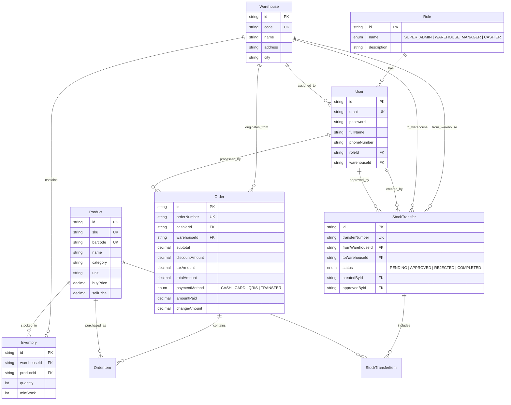

# OmniOps — B2B Operations & Multi-Store Inventory Platform

[](https://www.typescriptlang.org/)
[](https://nextjs.org/)
[](https://react.dev/)
[](https://nestjs.com/)
[](https://tailwindcss.com/)
[](https://www.prisma.io/)
[](https://www.mysql.com/)
[](https://www.mongodb.com/)
[](http://localhost:4000/api/docs)
[](LICENSE)

---

## Project Overview

**OmniOps** is an integrated enterprise operations management and Point of Sale (POS) platform designed to tackle the complexities of B2B distribution supply chains and modern multi-branch retail networks (multi-store / multi-warehouse).

### Problem Statement
In conventional retail and distribution operations:
1. **Inventory Silos:** Discrepancies between physical stock in central distribution hubs and retail branch stores.
2. **Data Tampering Risks:** Sensitive data changes (buying/selling prices, stock opname/adjustments, and order cancellations) frequently lack transparent audit trails.
3. **Slow Cashier Checkout:** Sluggish POS terminals or lack of integration with real-time stock availability in local warehouses.
4. **Lack of Executive Visibility:** Absence of a unified analytics dashboard to monitor sales performance, margins, and low-stock alerts in real time.

### The OmniOps Solution
OmniOps delivers a modular architecture that combines ACID-compliant financial transactions (**MySQL via Prisma ORM**) with high-throughput audit logging (**MongoDB Atlas via Mongoose**). It features a responsive, high-speed cashier terminal interface (Next.js 15 App Router & Zustand) and robust Role-Based Access Control (RBAC).

---

## System Architecture

The OmniOps system adopts a decoupled client-server architectural pattern communicating via a secure, isolated RESTful API:


---

## Key Features

### 1. Executive Analytics Dashboard (`/dashboard`)
- **Real-Time KPIs:** Tracking of Gross Revenue, total successful transactions, Low Stock Warnings, and total active SKU variants.
- **Sales Trend Visualization:** Interactive 7-day responsive area/bar charts powered by Recharts.
- **Top-Selling Products Leaderboard:** Top 5 product rankings based on sales volume and revenue contribution.
- **Multi-Branch Filtering:** Ability to view global aggregated metrics or filter specifically by warehouse branch.

### 2. Multi-Warehouse & Master Inventory (`/inventory`)
- **Master Product Catalog:** Complete management of SKU data, barcode-scanner-ready fields, categories, cost of goods sold (COGS / buy price), and selling prices.
- **Multi-Location Inventory:** Independent stock tracking for each warehouse (e.g., Central Hub, Jakarta Store, Bandung Store).
- **Automated Stock Alerts:** Detection of stock falling below minimum threshold levels with visual indicator badges.
- **Stock Opname (Stock Adjustment):** Manual stock adjustments requiring a mandatory audit reason, automatically recorded in the audit trail.
- **Strict Form Validation:** Add/edit product forms validated with Zod schemas and React Hook Form.

### 3. Inter-Warehouse Stock Transfer Workflow (`/transfers`)
- **Structured Transfer Lifecycle:** State progression: `PENDING` -> `APPROVED` -> `COMPLETED` / `REJECTED`.
- **ACID Transactional Integrity:** When a transfer is marked `COMPLETED`, the backend executes a Prisma `$transaction` that atomically decrements the origin warehouse inventory and increments the destination warehouse inventory simultaneously to prevent discrepancies.
- **Automated Stock Validation:** The system automatically rejects transfer requests if the origin warehouse has insufficient stock.

### 4. High-Speed Point of Sale (POS) Terminal (`/pos`)
- **Ergonomic Cashier Interface:** Optimized for touchscreen and desktop environments with rapid keyboard/click navigation.
- **Barcode Scanner Support:** Instant barcode input immediately appends items to the active cart.
- **Reactive Cart Management:** Powered by a Zustand store for instantaneous quantity updates, line-item discounts, and subtotal calculations.
- **Automated Financial Calculations:** Dynamic computation of VAT (11%), global order discounts, cash tendered, and exact change.
- **Thermal Receipt Printing:** Print-ready modal formatted for standard 58mm and 80mm thermal POS receipt printers.

### 5. Dual-Database & Immutable Audit Trail (`/audit-logs`)
- **Asynchronous Telemetry Logging:** Every critical operation (authentication, catalog modifications, stock adjustments, POS orders, and stock transfers) is logged asynchronously without blocking the primary MySQL transaction thread.
- **Payload Diff Inspector:** Visual UI to inspect data snapshots before (`oldValue`) and after (`newValue`) mutations with syntax-highlighted JSON diffing.
- **Resilience & Fallback:** If MongoDB Atlas becomes unavailable, the system automatically redirects logging to a non-blocking in-memory buffer, ensuring critical business workflows remain uninterrupted.

### 6. Role-Based Access Control (RBAC)
- Frontend route guards and backend endpoints are strictly protected based on JWT tokens and granular user roles.
- Password encryption using `bcrypt` with 10 salt rounds.

---

## Demo Accounts & Access Matrix

All demo accounts are preconfigured with the default password: **`admin123`**  
*(Can be accessed directly via the 1-Click Quick Login buttons on the login page)*

| Role | Account Email | Access Scopes |
|---|---|---|
| **Super Admin** | `admin@omniops.com` | Full system access, warehouse/branch management, user & staff management, global analytics reports, and complete audit log inspection. |
| **Warehouse Manager** | `manager@omniops.com` | Inter-warehouse stock transfer management, inbound/outbound approvals, stock opname (adjustments), and branch inventory monitoring. |
| **Cashier / Operator** | `cashier@omniops.com` | Daily POS terminal operations, barcode scanning, checkout transactions, and receipt printing. |

---

## Tech Stack & Technical Architecture

| Layer | Technology | Role & Justification |
|---|---|---|
| **Frontend Framework** | Next.js 15 (React 19 App Router) | High-performance rendering, Server & Client Components, modern routing architecture |
| **Styling & UI Components** | Tailwind CSS 4, Lucide React | Modular design system, responsive breakpoints, and consistent iconography |
| **State Management** | Zustand | Lightweight and performant state store for the POS cart and client session |
| **Form & UI Validation** | React Hook Form + Zod | Type-safe schema validation on the client UI layer |
| **Data Visualization** | Recharts | Interactive sales trend and KPI analytics charts |
| **Backend Framework** | NestJS 10 (TypeScript) | Enterprise architectural patterns (Dependency Injection, Controllers, Services, Modules) |
| **Relational ORM** | Prisma ORM 5 | End-to-end type safety for MySQL with automated schema migrations and atomic transactions |
| **Relational Database** | MySQL 8.0 | ACID-compliant storage for master catalogs, multi-branch inventories, warehouses, and orders |
| **NoSQL Database** | MongoDB Atlas / Mongoose 8 | Non-blocking, high-throughput storage for immutable telemetry and audit logs |
| **Security & Middleware** | Helmet, Compression, Throttler | HTTP security headers, Gzip/Brotli response compression, and anti-brute-force rate limiting |
| **API Documentation** | Swagger / OpenAPI | Interactive OpenAPI documentation hosted directly at `/api/docs` |

---

## Relational Data Model (MySQL via Prisma)



---

## Project Directory Structure

```
omniops/
├── Architecture.md         # Technical system architecture documentation
├── PRD.md                  # Product Requirement Document
├── Tasks.md                # Feature implementation checklist & status
├── Rules.md                # Coding conventions and engineering guidelines
├── package.json            # Root workspace scripts runner
├── .gitignore              # Git ignore rules for credentials & build artifacts
│
├── backend/                # NestJS API Engine
│   ├── prisma/
│   │   ├── schema.prisma   # MySQL schema, relations, & performance indexes
│   │   ├── seed.ts         # Database seed script for initial master data
│   │   └── migrations/     # Database migration history
│   ├── src/
│   │   ├── analytics/      # Executive dashboard metrics controller & service
│   │   ├── audit/          # MongoDB Mongoose schemas & audit trail service
│   │   ├── auth/           # JWT auth module, password hashing, & RBAC guards
│   │   ├── common/         # Global filters, interceptors, and validation pipes
│   │   ├── inventory/      # Stock tracking, adjustments, and transfer transactions
│   │   ├── orders/         # POS checkout engine, tax/discount calculation, & items
│   │   ├── prisma/         # Prisma Client service integrated with NestJS
│   │   ├── products/       # Master product catalog CRUD module
│   │   ├── warehouses/     # Warehouses and retail branch management module
│   │   ├── app.module.ts   # Root NestJS application module
│   │   └── main.ts         # Application entry point (Helmet, Swagger, CORS, Throttler)
│   ├── .env.example        # Backend environment variables template
│   └── package.json
│
└── frontend/               # Next.js 15 App Router Frontend
    ├── public/             # Static public assets
    └── src/
        ├── app/
        │   ├── audit-logs/ # Audit trail and JSON diff viewer page
        │   ├── dashboard/  # Analytics metrics and sales trend dashboard page
        │   ├── inventory/  # Master catalog and stock adjustment modal page
        │   ├── login/      # Login page with 1-click Quick Login demo
        │   ├── pos/        # POS cashier terminal, scanner, and receipt printer page
        │   ├── transfers/  # Inter-warehouse stock transfer management page
        │   ├── layout.tsx  # Root application layout and navigation bar
        │   └── page.tsx    # Root redirection to dashboard or login
        ├── components/     # Reusable UI components & modal dialogs
        ├── lib/            # Axios API client, auth helpers, & formatters
        ├── types/          # TypeScript type and interface definitions
        ├── .env.example    # Frontend environment variables template
        └── package.json
```

---

## Quick Start & Installation Guide

### 1. Prerequisites
- **Node.js**: v20.x or higher LTS release
- **MySQL**: Running database service on port `3306` (via XAMPP, Laragon, Docker, or standalone MySQL Server) with a database named `omniops_db`
- **MongoDB**: *(Optional)* MongoDB Atlas connection string or local MongoDB instance for logging. If omitted, the system automatically uses the in-memory fallback buffer.

---

### 2. Backend Setup (`backend/`)

Open a terminal and navigate to the backend directory:
```bash
cd backend

# 1. Install backend dependencies
npm install

# 2. Copy the environment variables template
cp .env.example .env
```

Ensure `.env` matches your local MySQL credentials:
```env
PORT=4000
DATABASE_URL="mysql://root:@localhost:3306/omniops_db"
JWT_SECRET="omniops-enterprise-jwt-secret-key-2026"
CORS_ORIGINS="http://localhost:3000"
```

Run database migrations and seed the initial master data:
```bash
# 3. Apply Prisma migrations to generate MySQL tables
npx prisma migrate dev --name init

# 4. Seed initial database records (Admin, Manager, Cashier, Warehouses, & Catalog Products)
npx prisma db seed

# 5. Start the backend development server
npm run start:dev
```
- API Base URL: `http://localhost:4000/api`
- Swagger OpenAPI Documentation: `http://localhost:4000/api/docs`

---

### 3. Frontend Setup (`frontend/`)

Open a second terminal and navigate to the frontend directory:
```bash
cd frontend

# 1. Install frontend dependencies
npm install

# 2. Copy the environment variables template
cp .env.example .env.local
```

Configure `.env.local`:
```env
NEXT_PUBLIC_API_URL=http://localhost:4000/api
```

Start the Next.js development server:
```bash
npm run dev
```

Open your browser at `http://localhost:3000`.

---

### 4. Running Concurrently from Root Directory

From the project root directory (`omniops/`), you can start both backend and frontend servers:
```bash
# Terminal 1: Start Backend
npm run dev:backend

# Terminal 2: Start Frontend
npm run dev:frontend
```

---

## RESTful API Endpoints Summary

All transactional endpoints are secured with JWT Bearer authentication via the header `Authorization: Bearer <token>`.

| Module | Method | Endpoint Path | Description & Access Scope |
|---|---|---|---|
| **Auth** | `POST` | `/api/auth/login` | Authenticate user, return JWT and user profile |
| **Auth** | `GET` | `/api/auth/profile` | Retrieve active authenticated session info |
| **Warehouses** | `GET` | `/api/warehouses` | List all warehouses and retail store branches |
| **Warehouses** | `POST` | `/api/warehouses` | Register new warehouse or retail store *(Super Admin)* |
| **Products** | `GET` | `/api/products` | Product catalog with category filter & search |
| **Products** | `POST` | `/api/products` | Create new product with SKU & barcode validation |
| **Products** | `PUT` | `/api/products/:id` | Update existing master product |
| **Inventory** | `GET` | `/api/inventory` | Real-time multi-location inventory & low-stock alerts |
| **Inventory** | `POST` | `/api/inventory/adjustment` | Manual stock opname (adjustment) with audit reason |
| **Inventory** | `GET` | `/api/inventory/transfers` | Inter-branch stock transfer history and statuses |
| **Inventory** | `POST` | `/api/inventory/transfers` | Submit inter-warehouse stock transfer request |
| **Inventory** | `PATCH`| `/api/inventory/transfers/:id/status` | Approve/complete stock transfer *(ACID Transaction)* |
| **Orders** | `POST` | `/api/orders` | POS cashier checkout, tax calculation, & inventory deduction |
| **Orders** | `GET` | `/api/orders` | Order history and cashier transaction records |
| **Analytics** | `GET` | `/api/analytics/dashboard` | Aggregated executive KPIs and 7-day revenue trends |
| **Audit Logs** | `GET` | `/api/audit` | Telemetry audit trail history and JSON before/after diffs |

Complete API documentation and interactive test runner are available via **Swagger UI** at:  
`http://localhost:4000/api/docs`

---

## Quality Standards & Security Hardening

- **End-to-End Type Safety:** Fully typed in strict TypeScript (*no implicit any*) across both backend and frontend applications.
- **Defensive DTO Validation:** Inbound request payloads are strictly validated using NestJS `ValidationPipe` with `class-validator` (`whitelist: true` & `forbidNonWhitelisted: true` preventing unauthorized field injection).
- **Cryptographic Hashing:** One-way password hashing using `bcrypt` with 10 salt rounds.
- **HTTP Header Hardening:** `helmet` integration disabling vulnerable headers and enforcing industry-standard XSS and MIME sniffing protections.
- **Anti-Brute-Force Rate Limiting:** Sensitive endpoints guarded by `@nestjs/throttler`.
- **Standardized Response Envelope:** Uniform API interceptor producing `{ success: true, statusCode: 200, message: "...", data: ... }` for predictable client consumption.
- **Fail-Safe Logging:** Non-blocking MongoDB audit logging never interrupts core transaction flows if the remote logging service encounters latency or network downtime.

---

## License

This project is licensed under the [MIT License](LICENSE). Free to use, modify, and distribute for both research and commercial operations.
