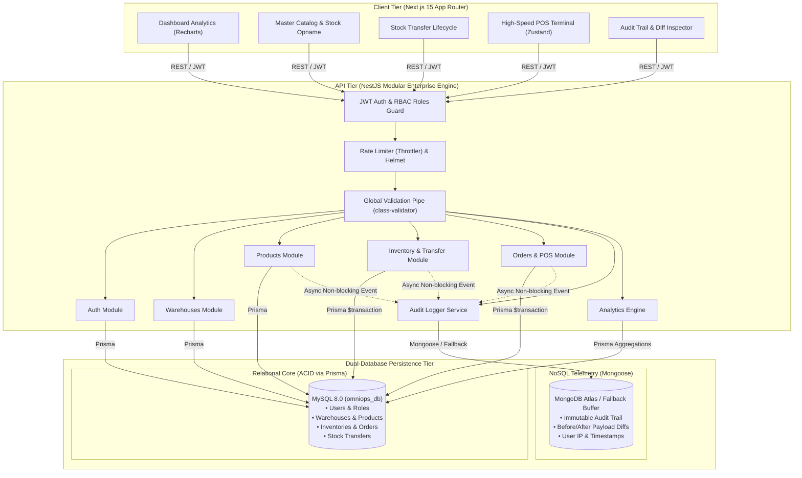

# OmniOps — B2B Operations & Multi-Store Inventory Platform

[](https://www.typescriptlang.org/)
[](https://nextjs.org/)
[](https://react.dev/)
[](https://nestjs.com/)
[](https://tailwindcss.com/)
[](https://www.prisma.io/)
[](https://www.mysql.com/)
[](https://www.mongodb.com/)
[](http://localhost:4000/api/docs)
[](LICENSE)

---

## 📌 Ringkasan & Deskripsi Proyek (Project Overview)

**OmniOps** adalah platform enterprise *operations management* dan *point of sale* (POS) terpadu yang dirancang untuk mengatasi kompleksitas rantai pasok distribusi B2B serta jaringan ritel modern multi-cabang (*multi-store / multi-warehouse*).

### Masalah yang Diselesaikan (Problem Statement)
Pada operasional retail dan distribusi konvensional:
1. **Silo Inventaris:** Terjadinya selisih stok fisik antar gudang pusat (*distribution hub*) dan toko ritel cabang (*retail store*).
2. **Resiko Manipulasi Data:** Perubahan data sensitif (harga jual/beli, *stock opname*, dan pembatalan pesanan) sering kali tidak memiliki riwayat audit yang transparan.
3. **Lambatnya Transaksi Kasir:** Terminal POS yang lambat atau tidak terintegrasi dengan ketersediaan stok aktual di gudang lokal.
4. **Visibilitas Eksekutif:** Ketiadaan dashboard analitik terpadu untuk memantau performa penjualan, margin, dan peringatan stok menipis secara *real-time*.

### Solusi OmniOps
OmniOps menghadirkan arsitektur modular yang memadukan keandalan transaksi finansial berbasis **ACID (MySQL via Prisma ORM)** dengan kecepatan penulisan log audit tingkat tinggi berbasis **Document-based (MongoDB Atlas via Mongoose)**. Dilengkapi dengan antarmuka kasir cepat (Next.js 15 App Router & Zustand) serta sistem perizinan berbasis peran (*Role-Based Access Control*).

---

## 🏗️ Arsitektur Sistem (System Architecture)

Sistem OmniOps mengadopsi pola arsitektur *decoupled client-server* via RESTful API yang aman dan terisolasi:



---

## ✨ Fitur-Fitur Utama (Key Features)

### 1. 📊 Executive Analytics Dashboard (`/dashboard`)
- **Real-Time KPIs:** Pemantauan pendapatan kotor (*Gross Revenue*), total transaksi sukses, peringatan stok menipis (*Low Stock Warnings*), dan total varian SKU aktif.
- **Visualisasi Tren Penjualan:** Grafik interaktif 7-hari berbasis grafik area / batang responsif (`Recharts`).
- **Leaderboard Produk Terlaris:** Peringkat 5 produk teratas berdasarkan volume penjualan dan kontribusi omzet.
- **Filter Multi-Cabang:** Kemampuan melihat data agregasi global atau memfilter per cabang gudang secara spesifik.

### 2. 🏢 Multi-Warehouse & Master Inventory (`/inventory`)
- **Katalog Master Produk:** Pengelolaan data SKU, Barcode scanner ready, Kategori, Harga Beli (*Cost of Goods Sold*), dan Harga Jual.
- **Multi-Location Inventory:** Pelacakan stok independen untuk masing-masing gudang (misal: *Central Hub*, *Store Jakarta*, *Store Bandung*).
- **Peringatan Stok Otomatis:** Deteksi stok di bawah ambang batas minimal (*minimum stock threshold*) dengan penanda warna (*badge* indikator).
- **Stock Opname (Adjustment Modal):** Penyesuaian stok manual dengan input alasan perubahan (*audit reason*) yang otomatis tercatat di log audit.
- **Validasi Form Ketat:** Form penambahan dan edit produk divalidasi dengan Zod schema dan React Hook Form.

### 3. 🔄 Inter-Warehouse Stock Transfer Workflow (`/transfers`)
- **Siklus Hidup Transfer:** Status terstruktur `PENDING` ➔ `APPROVED` ➔ `COMPLETED` / `REJECTED`.
- **Integritas Transaksional ACID:** Pada saat transfer diselesaikan (`COMPLETED`), backend mengeksekusi Prisma `$transaction` yang secara atomik mengurangi stok gudang asal dan menambah stok gudang tujuan secara bersamaan untuk mencegah ketidaksesuaian.
- **Validasi Stok Otomatis:** Sistem menolak transfer jika stok di gudang asal tidak mencukupi.

### 4. 💳 High-Speed Point of Sale (POS) Terminal (`/pos`)
- **Antarmuka Kasir Ergonomis:** Dirancang optimal untuk layar sentuh (*touchscreen*) maupun desktop dengan navigasi cepat.
- **Dukungan Barcode Scanner:** Input barcode instan langsung menambahkan item ke keranjang kasir.
- **Manajemen Keranjang Reaktif:** Ditenagai Zustand store untuk update kuantitas, penambahan diskon produk, dan kalkulasi subtotal instan.
- **Kalkulasi Finansial Otomatis:** Perhitungan pajak PPN (11%), diskon global kasir, nominal uang diterima (*cash tendered*), dan uang kembalian (*change*).
- **Cetak Struk Termal:** Modal struk digital siap cetak yang ramah printer thermal POS (58mm/80mm).

### 5. 🛡️ Dual-Database & Immutable Audit Trail (`/audit-logs`)
- **Pencatatan Telemetri Asinkron:** Setiap tindakan krusial (login, modifikasi katalog, *stock opname*, transaksi POS, dan transfer stok) dicatat tanpa memperlambat thread utama transaksi MySQL.
- **Payload Diff Inspector:** Antarmuka visual untuk menginspeksi snapshot data sebelum (`oldValue`) dan sesudah (`newValue`) perubahan dalam format JSON berwarna.
- **Toleransi Kegagalan (Resilience):** Jika koneksi MongoDB Atlas offline, sistem secara otomatis mengalihkan penyimpanan ke *non-blocking in-memory buffer* sehingga alur bisnis utama tidak pernah terputus.

### 6. 🔐 Role-Based Access Control (RBAC)
- Perizinan rute frontend dan endpoint backend dikontrol ketat berdasarkan JWT token dan peran pengguna.
- Enkripsi kata sandi menggunakan `bcrypt` dengan 10 salt rounds.

---

## 👥 Akun Demo & Matriks Hak Akses

Semua akun demo telah dikonfigurasi dengan kata sandi bawaan: **`admin123`**  
*(Dapat langsung digunakan melalui tombol 1-Click Quick Login pada halaman login)*

| Peran (Role) | Email Akun | Cakupan Hak Akses (Access Scopes) |
|---|---|---|
| **Super Admin** | `admin@omniops.com` | Akses sistem penuh, manajemen gudang/cabang, manajemen user & staf, laporan analitik global, dan inspeksi seluruh audit log. |
| **Warehouse Manager** | `manager@omniops.com` | Manajemen transfer stok antar gudang, persetujuan (*approval*) barang masuk/keluar, stock opname, dan pemantauan stok cabang. |
| **Cashier / Operator** | `cashier@omniops.com` | Operasional terminal kasir POS harian, scan barcode barang, transaksi pembayaran, dan pencetakan struk. |

---

## 💻 Tech Stack & Arsitektur Teknis

| Layer | Teknologi | Peran & Justifikasi |
|---|---|---|
| **Frontend Framework** | Next.js 15 (React 19 App Router) | Rendering performa tinggi, Server & Client Components, arsitektur route modern |
| **Styling & Icons** | Tailwind CSS 4, Lucide React | Sistem desain modular, *responsive breakpoint*, dan ikonografi konsisten |
| **State Management** | Zustand | State store ringan dan cepat untuk keranjang POS dan session client |
| **Form & Validasi UI** | React Hook Form + Zod | Validasi skema tipe aman di sisi antarmuka pengguna |
| **Data Visualization** | Recharts | Grafik analitik tren penjualan interaktif |
| **Backend Framework** | NestJS 10 (TypeScript) | Pola arsitektur enterprise (Dependency Injection, Controllers, Services, Modules) |
| **Relational ORM** | Prisma ORM 5 | Tipe aman penuh untuk MySQL dengan migrasi skema dan dukungan atomic transactions |
| **Relational Database** | MySQL 8.0 | Penyimpanan data master, inventaris, relasi warehouse, dan order transaksi (ACID) |
| **NoSQL Database** | MongoDB Atlas / Mongoose 8 | Penyimpanan log audit telemetri berkecepatan tinggi tanpa blocking |
| **Keamanan & Middleware**| Helmet, Compression, Throttler | Proteksi header HTTP, kompresi Gzip/Brotli, dan rate limiting anti brute-force |
| **Dokumentasi API** | Swagger / OpenAPI | Dokumentasi endpoint interaktif yang terintegrasi langsung di `/api/docs` |

---

## 🗄️ Model Data Relasional (MySQL via Prisma)


---

## 📂 Struktur Direktori Proyek (Project Structure)

```
omniops/
├── Architecture.md         # Dokumen arsitektur teknis sistem
├── PRD.md                  # Product Requirement Document
├── Tasks.md                # Checklist status implementasi fitur
├── Rules.md                # Pedoman & standar coding konvensi
├── package.json            # Root runner scripts
├── .gitignore              # Git ignore rules untuk credentials & build artifacts
│
├── backend/                # NestJS API Engine
│   ├── prisma/
│   │   ├── schema.prisma   # Skema MySQL, relasi, & indeks performa
│   │   ├── seed.ts         # Script seeding master data awal
│   │   └── migrations/     # Riwayat migrasi database
│   ├── src/
│   │   ├── analytics/      # Controller & Service metrik dashboard eksekutif
│   │   ├── audit/          # Skema Mongoose MongoDB & service audit trail
│   │   ├── auth/           # Modul otentikasi JWT, password hashing, & RBAC guards
│   │   ├── common/         # Global filters, interceptors, dan validation pipes
│   │   ├── inventory/      # Stock tracking, opname, dan transfer transaksi
│   │   ├── orders/         # POS checkout engine, kalkulasi order, & items
│   │   ├── prisma/         # Prisma Client Service terintegrasi NestJS
│   │   ├── products/       # Modul master katalog produk (CRUD)
│   │   ├── warehouses/     # Modul data gudang dan cabang ritel
│   │   ├── app.module.ts   # Root NestJS application module
│   │   └── main.ts         # Entry point (Helmet, Swagger, CORS, Throttler)
│   ├── .env.example        # Template variabel lingkungan backend
│   └── package.json
│
└── frontend/               # Next.js 15 App Router Frontend
    ├── public/             # Static assets
    └── src/
        ├── app/
        │   ├── audit-logs/ # Halaman audit trail & JSON diff viewer
        │   ├── dashboard/  # Halaman dashboard metrik & tren penjualan
        │   ├── inventory/  # Halaman katalog master & modal stock opname
        │   ├── login/      # Halaman login dengan 1-click Quick Login demo
        │   ├── pos/        # Halaman terminal kasir POS, scanner, & cetak struk
        │   ├── transfers/  # Halaman manajemen transfer stok antar gudang
        │   ├── layout.tsx  # Root layout & navbar navigasi
        │   └── page.tsx    # Redirect root ke dashboard/login
        ├── components/     # UI reusable components & modal dialogs
        ├── lib/            # Axios API client, auth helper, & formatters
        ├── types/          # Definisi TypeScript interface
        ├── .env.example    # Template variabel lingkungan frontend
        └── package.json
```

---

## 🚀 Panduan Instalasi & Menjalankan (Quick Start)

### 1. Prasyarat Sistem
- **Node.js**: v20.x atau versi LTS yang lebih tinggi
- **MySQL**: Layanan database aktif di port `3306` (via XAMPP, Laragon, Docker, atau MySQL Server standalone) dengan database bernama `omniops_db`
- **MongoDB**: *(Opsional)* MongoDB Atlas connection string atau instance MongoDB lokal untuk logging. Jika tidak diisi, sistem otomatis mengaktifkan *in-memory fallback buffer*.

---

### 2. Setup Backend (`backend/`)

Buka terminal dan navigasikan ke direktori backend:
```bash
cd backend

# 1. Pasang dependensi backend
npm install

# 2. Gandakan template environment variables
cp .env.example .env
```

Pastikan konfigurasi `.env` sesuai dengan kredensial MySQL lokal Anda:
```env
PORT=4000
DATABASE_URL="mysql://root:@localhost:3306/omniops_db"
JWT_SECRET="omniops-enterprise-jwt-secret-key-2026"
CORS_ORIGINS="http://localhost:3000"
```

Jalankan migrasi database dan seeding data awal:
```bash
# 3. Buat tabel dan skema database MySQL
npx prisma migrate dev --name init

# 4. Masukkan data awal (Akun Admin, Manajer, Kasir, Gudang, & Produk Katalog)
npx prisma db seed

# 5. Jalankan backend server dalam mode development
npm run start:dev
```
- API Base URL: `http://localhost:4000/api`
- Swagger OpenAPI Docs: `http://localhost:4000/api/docs`

---

### 3. Setup Frontend (`frontend/`)

Buka terminal kedua dan navigasikan ke direktori frontend:
```bash
cd frontend

# 1. Pasang dependensi frontend
npm install

# 2. Gandakan template environment variables
cp .env.example .env.local
```

Isi variabel `.env.local`:
```env
NEXT_PUBLIC_API_URL=http://localhost:4000/api
```

Jalankan Next.js development server:
```bash
npm run dev
```

Buka browser Anda di `http://localhost:3000`.

---

### 4. Menjalankan Sekaligus dari Root Directory

Dari direktori utama proyek (`omniops/`), Anda dapat menjalankan backend dan frontend secara praktis:
```bash
# Terminal 1: Menjalankan Backend
npm run dev:backend

# Terminal 2: Menjalankan Frontend
npm run dev:frontend
```

---

## 📡 Ringkasan RESTful API Endpoints

Semua endpoint transaksional diproteksi dengan Bearer Token JWT melalui header `Authorization: Bearer <token>`.

| Modul | Method | Endpoint Path | Deskripsi & Hak Akses |
|---|---|---|---|
| **Auth** | `POST` | `/api/auth/login` | Login user, mengembalikan JWT & profil pengguna |
| **Auth** | `GET` | `/api/auth/profile` | Mendapatkan info sesi user yang sedang aktif |
| **Warehouses** | `GET` | `/api/warehouses` | Daftar seluruh gudang dan toko ritel cabang |
| **Warehouses** | `POST` | `/api/warehouses` | Registrasi gudang cabang baru *(Super Admin)* |
| **Products** | `GET` | `/api/products` | Katalog master produk dengan filter kategori & pencarian |
| **Products** | `POST` | `/api/products` | Tambah produk baru dengan validasi SKU & Barcode |
| **Products** | `PUT` | `/api/products/:id` | Update master produk |
| **Inventory** | `GET` | `/api/inventory` | Daftar stok real-time per gudang & notifikasi low stock |
| **Inventory** | `POST` | `/api/inventory/adjustment` | Stock Opname manual dengan pencatatan alasan |
| **Inventory** | `GET` | `/api/inventory/transfers` | Riwayat dan status transfer stok antar cabang |
| **Inventory** | `POST` | `/api/inventory/transfers` | Pengajuan transfer barang antar gudang |
| **Inventory** | `PATCH`| `/api/inventory/transfers/:id/status` | Persetujuan/penyelesaian transfer *(ACID Transaction)* |
| **Orders** | `POST` | `/api/orders` | Checkout transaksi POS kasir, kalkulasi pajak, & potong stok |
| **Orders** | `GET` | `/api/orders` | Riwayat pesanan dan riwayat penjualan kasir |
| **Analytics** | `GET` | `/api/analytics/dashboard` | Agregasi metrik KPI dan tren omzet 7-hari |
| **Audit Logs** | `GET` | `/api/audit` | Riwayat audit trail telemetri dan JSON before-after diff |

Dokumentasi lengkap dan antarmuka uji coba interaktif dapat diakses langsung via **Swagger UI** di:  
🔗 `http://localhost:4000/api/docs`

---

## 🛡️ Standar Kualitas & Keamanan (Security & Hardening)

- **Type-Safety End-to-End:** Seluruh kode ditulis menggunakan TypeScript ketat (*no implicit any*) di backend maupun frontend.
- **Defensive DTO Validation:** Setiap payload request divalidasi ketat oleh `ValidationPipe` NestJS berbasis `class-validator` (mencegah field injection yang tidak terdaftar via `whitelist: true` & `forbidNonWhitelisted: true`).
- **Cryptographic Hashing:** Penyimpanan password di-hash secara satu arah menggunakan `bcrypt`.
- **HTTP Header Hardening:** Integrasi `helmet` untuk menonaktifkan header berbahaya dan mengaktifkan proteksi XSS/sniffing standar industri.
- **Anti Brute-Force Rate Limiting:** Proteksi endpoint sensitif dengan `@nestjs/throttler`.
- **Response Format Standar:** Interceptor seragam `{ success: true, statusCode: 200, message: "...", data: ... }` mempermudah integrasi client.
- **Fail-Safe Logging:** Logging MongoDB non-blocking tidak menghalangi eksekusi transaksi jika koneksi remote log mengalami latensi atau gangguan jaringan.

---

## 📄 Lisensi (License)

Proyek ini dirilis di bawah lisensi [MIT License](LICENSE). Bebas digunakan, dimodifikasi, dan dikembangkan untuk keperluan riset maupun operasional komersial.
